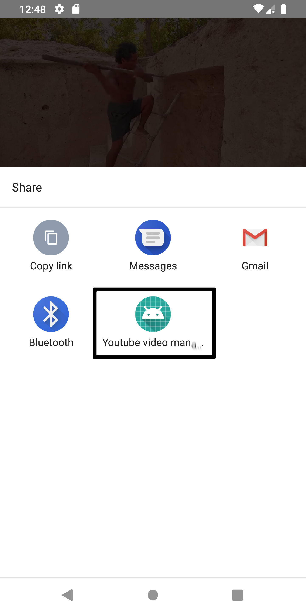

# Vid_download
Simple video downloader using yt-download.org API

Hello there, this is a simple way to use yt-download.org API to download videos in MP4 or MP3 format.
Feel free to improve it by adding more things.
# Usage:
Go to youtube, select some video, hit share and choose our application.You will figure the reste by yourself.
# One:

# Two :

